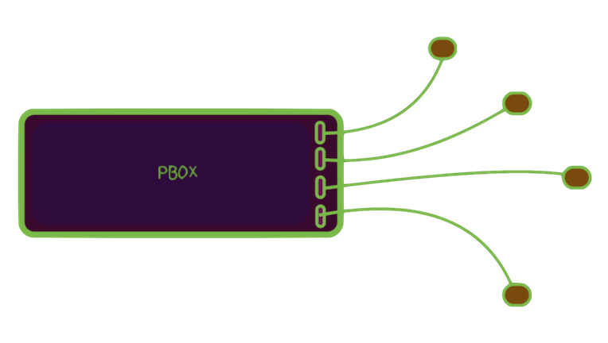
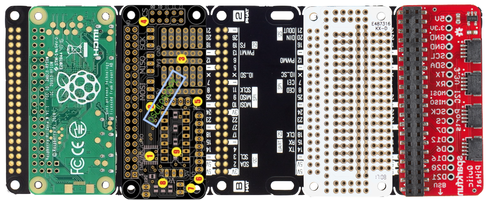

# RaspberryProduce

Is a store for the production of village infrastructure & cottage industry tools centered on Linux/Python control & automation of: information, electromagnetic, fluid, & mechanical work: [pbox automation, Cyclone fluid, VESC electrical power conversion ] tools.

The unifying product/concept for the store is a new class of PC, codename pbox. The PC is itself a prototyping environment that through subtraction evolves to the prototype & production tool. 

Backplane is shared GPIO for Hats utilizing Pimoroni backplane & I2C devices with two sizes of JST plugs for Sparkfun & Adafruit. Open, portable, low profile.  

  

  

Intended as general purpose toolkit for new class of cost & energy efficient industrial applications such as refrigeration, electric transport, power generation & storage.

While the focus is industrial, the prices, openness, architecture, applicability, & efficiency are optimal & best of class. The assumption being that price is the barrier to entry for light industrial development of village centers & cottage industry. Industrial quality brushless drives, e.g. are thousands of dolllars, but are now availble for the cost of the PCB & BOM.

Economically, the intention is to catalyze distributed ownership of manufacturing to compete with centralized displacement of workers via AI,robotics, & end-user consumption of leased product marketing.

All products are scalable from single family to village-sized or larger & designed to be be competitive with the best-of-class industrial solutions.

  
  
  

## Stage I
Portable, compact, rpi Zero focused breadboarding
## Stage II
Testing of hats with GPIO &/or I2C plugs
## Stage III
Addition of analog I/O & oscilloscope
## Stage IV
Mixing of breadboard designs & hats & reduction of function
## Stage V
Further reduction of sauce moving breadboard circuits to protoboards
## Stage VI
Custom hat development

#Donate

I am doing the project dev on my own dime, donations accepted & appreciated!

[Wishlist](wishlist.pdf)

[I'm an inline-style link](https://www.google.com)

[I'm an inline-style link with title](https://www.google.com "Google's Homepage")

[I'm a reference-style link][Arbitrary case-insensitive reference text]

[I'm a relative reference to a repository file](../blob/master/LICENSE)

