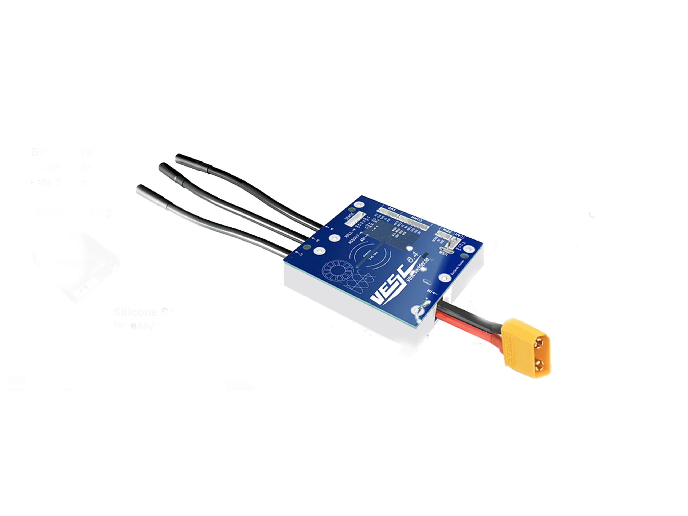
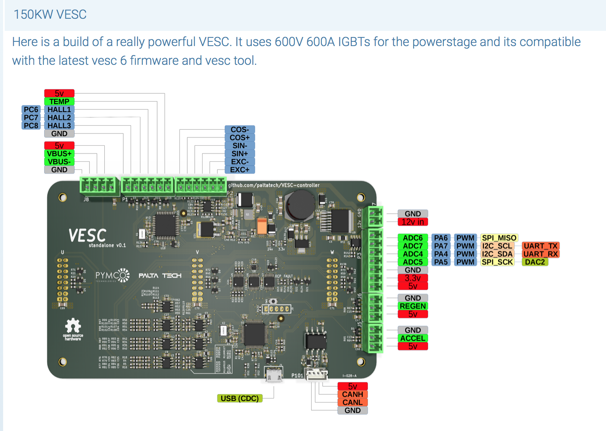

  
Raspberryproduce is a store for curating & distributing the best RPI Zero tools with a focus on the design, development, & production of village infrastructure. Tool kits are in development for control & automation of energy, mechanical, & fluid systems.

  

The unifying concept for the store is a new class of PC, code name--Cuban Flatbread. This PC is designed to be a flexibile prototyping environment for simple & general purpose standardized industrial processes. These building blocks can be assembled into systems of utility for satisfying basic needs of decentralized peer to peer structures.

The configuration reduces to the prototype & production tools as the prototype evolves, without significant changes to the dev-env. 

The system architecture organizational concept is the utilization of shared GPIO for Hats utilizing a Pimoroni backplane in combination with the Sparkfun I2C ecology with 1mm pitch, 4-pin JST connector. The design is intended to bring the functionality of prototyping environments beyond the level of gizmos, to include all required system functionality & power, while minimzing custom work & maintaining a mobile environment. 

Low profile, highly integrated, with minimal need for breadboarding, simplifies the initial development while consolidating the system for manageable workspaces.

  

  
  

80% of all energy used on the planet goes to spinning electrical motors inefficiently. Developing nations are bringing more online exponentially with a bias toward inexpensive systems. 5%-50% worldwide net gains are thus possible by lowering the price barrier to high performance energy utilization. 

The initial reference design will focus on support systems for the VESC electric motor driver & power conversion software. Ben Vedder's 50V 100A reference design is in high demand with the skate community, & a 75V 200A reference design is in the prototyping stage. An IGBT reference design is available with a clear path to SiC mosfets.

The development concept is not unlike the [Two Cowboy](https://www.youtube.com/watch?v=SDHqzUz39mU) dark fiber infrasture in Old's Canada. 

The working assumption is that the barrier to adoption to commodity electromechanical & power systems are the complexities introduced by the middleman involved in de-creaming the technology. Highly refined industrial control & software commutation is now available in mass production, up to 10's of kw power density. Therefore, getting the best systems into builders hands brings the heart of mechanical industrial processes to small groups of individuals without requiring capitalization by fiat currency; elimating the dependency on a banker in the system.

Increasing the distribution of ownership of manufacturing & energy production can compete effectively with centralized entities enganged in displacement of salaried labor via AI, robotics, & surveillance. The reference system in development is designed to provide a viable alternative for those interested in devloping these concepts in their communities.

All products are designed to be scalable from single family to village-sized or larger & are intended to outperform modern industry standards. 

IGBT design based off a Silicon Carbide reference. The wide-bandgap materials are good for power densities in excess of a megawatt for a small system.

  

## Stage Zero [pdf](pdf/stagezero.pdf)
RPI Zero hardware & software setup
  
## Stage I [pdf](pdf/stagei.pdf)
Portable, compact, RPI Zero focused breadboarding with integration of [Pigpio](http://abyz.me.uk/rpi/pigpio/).
  
## Stage II [pdf](pdf/stageii.pdf)
Cuban Flatbread: Multiple hats with GPIO &/or I2C plugs
  
## Stage III
General subsystems
  
### Stage III.1 [pdf](pdf/stageiii.pdf)
Analog I/O & oscilloscope
### Stage III.2 
Data presentation: Eink, Oled, Neopixel, etc.
### Stage III.3 
CAN, UART, PPM, for inverter/motor controller
  
## Stage IV [pdf](pdf/stageiv.pdf)
Mixing of breadboard designs & hats; reduction of function
  
## Stage V [pdf](pdf/stagev.pdf)
Add custom power. Further reduction of sauce, moving breadboard circuits to protoboards
  
## Stage VI [pdf](pdf/stagevi.pdf)
Custom hat development, research, testing
  

## Status
Concept development
  

## Next Steps
Sourcing, assembly, testing of Cuban Flatbread 
Toss in VESC
  

## Major Milestone Targets
* Offgrid power plant supporting water, cooling, & light. 25KWH energy storage integrated with .25-25kw VESC machines as end-to-end scalable in size & number. All inclusive system costs less than $1/watt. 

  
## Donations
eGiftCard:  theloniustrout@gmail.com 
Fiat:       paypal.me/entangled@gmail.com 
Bitcoin:    36fAic98Sevtonnr75orbn3w3tGfVcct8V 
STEEM:      @theloniustrout 

[Wishlist](fuel.pdf)

