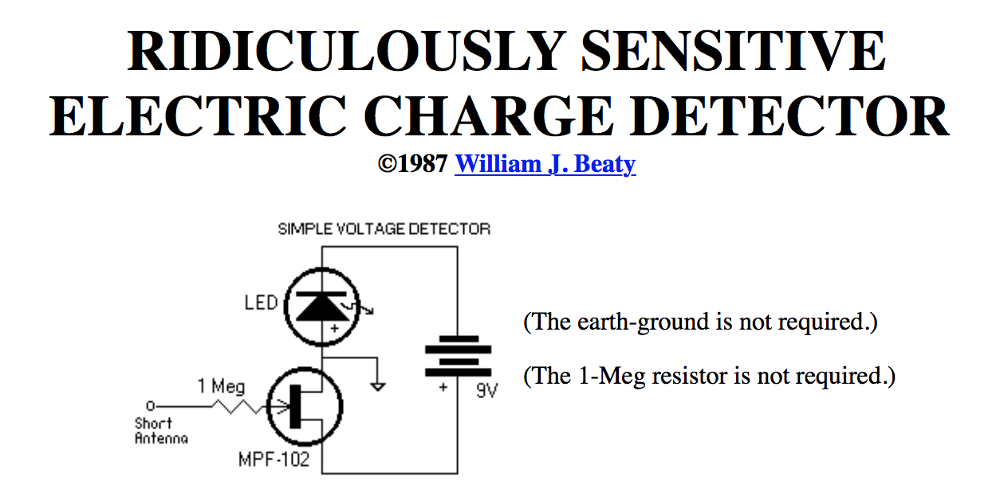

  
Raspberryproduce is a test store for RPI Zero based physics toys & learning steps from prototype to production. Test site is based on best bang for the buck analog educational circuit--open gate FET, & RPI Zero version thereof. Sensor extension is via pluggable I2C sensor & ADC Hat. Visualization extensions via fats in pinouts.xyz. Electronics concepts via Carver Mead CED.

  

RPI Zero Demon hunting kits
Elecricity is everywhere & is creepy as hell--demon-straightion charge conservation in the style of Carver Mims.
   CED not fluid analogy of charge, etc.

* Kit 1: 3x 1/4 size breadboard, jumpers, 5x LED, 5x FET
* Kit 2: Iron, solder, flux, brass, 10x FET, 10x LED, 5x proto boards
* Kit 3: Battery charger & solar cell
* Kit 4: A2D Hat & Pimoroni Phat Stack
* Kit 5: High power wifi enabled flashlight kit--dims light when demon present. Software tuned for broad & creepy dynamic range.
* Kit 6: Visual options field modulated
* Kit 7: Audio Synth options field modulated
* Kit 8: Young indstrualist kit--Kicad to PCB

  

[article](http://amasci.com/emotor/chargdet.html)

  
  

# Prototyping Kits from Analog to Electroscope Hat
Cuban Flatbread portable prototyping workstation. 
Shared GPIO bus for Hats utilizing a Pimoroni backplane in combination with the Sparkfun breakouts with 1mm pitch, 4-pin JST connector as the last Hat on the bus.  

The design is intended to save time prototyping gizmos as well as larger systems in the same dev-env, to include all required system functionality & power, while minimzing custom work & maintaining a mobile environment.  

Extend [pinout.xyz](pinout.xyz) to all known hats & add links to store. 

Solarbotics version [circuits](http://solarbotics.net/library/circuits/sensors_field.html)

  

## Source References
RPI zero image
Phat stack mini ➜ Sparkfun Qwiic connect ➜ I2C [ADC PiZero](https://thepihut.com/products/adc-pizero)  2x MCP3424 
[analog zero](https://pinout.xyz/pinout/analog_zero)  MCP3008    8 channel SPI 
[Phat DAC](https://www.digikey.com/product-detail/en/pimoroni-ltd/PIM138/1778-1054-ND/6928267&?gclid=EAIaIQobChMIk8rPu-_Q2QIVBQ5pCh3xIAn7EAQYAyABEgLNyfD_BwE) 
[adafruit](https://learn.adafruit.com/raspberry-pi-analog-to-digital-converters/overview) 
[ADC boards](https://pinout.xyz/boards#type=ADC) 
Pull request for missing boards [github](https://github.com/gadgetoid/Pinout.xyz) 
Pimoroni Phat Stack [adafruit](https://www.adafruit.com/product/3742) Out of stock 
Check again pin collions: [pinout.xyz](https://pinout.xyz/phatstack)
Concept consolidation: rpi electroscope--from physics to production.
  

## Status
Research RPI electroscope
  

## Next Steps
Source parts: 

* Have: Zero, FET, cap, 1Mohm, li battery, breadboard, protoboard, surface mount short header, li-bat.
* Don't have: ADC, zero li charger, phat stack, solder, more short surface mount headers.
USB [charged](https://github.com/NeonHorizon/lipopi), [powerboost500](https://www.adafruit.com/product/1944)solar powered kit

Test/write:
* Test electroscope
* Write instructions for bringing to breadboard
* Test electroscope ADC
* Write instructions for ADC

* Write instructions for moving to protoboard
* Write instruction along the way
  

  
## Donations
eGiftCard:  theloniustrout@gmail.com 
Fiat:       paypal.me/entangled@gmail.com 
Bitcoin:    36fAic98Sevtonnr75orbn3w3tGfVcct8V 
STEEM:      @theloniustrout 

[Giftlist](doc/giftlist)

