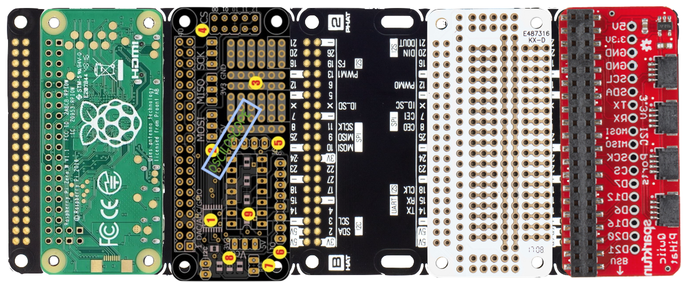

  
Raspberryproduce is a store for curating & distributing the best RPI Zero tools for the production of village infrastructure & cottage industry tools for  control & automation of: information, fluid & mechanical work & storage on the respective platforms: Linux/Python, [Cyclone](http://cyclone-power.com) steam power & fluid energy storage & conversion, [VESC](http://vesc-project.com) electrical power conversion.

  

The unifying concept for the store is a new class of PC--Cuban flatbread. The PC is itself a maximally generalized & flexibile prototyping environment that reduces to the prototype & production tool as the prototype evolves, without significant changes to the dev-env. 

Backplane is shared GPIO for Hats utilizing Pimoroni backplane & I2C devices with two sizes of JST plugs for Sparkfun & Adafruit. Open, portable, low profile. Nothing new or fancy; just an entropy reducer to simplify the process & a collection of th best stuff in one place. 

  

  
  

Intended as general purpose toolkit for new class of cost & energy efficient industrial applications such as refrigeration, electric transport, power generation & storage.

While the focus is industrial, the prices, openness, architecture, applicability, & efficiency are optimal & best of class. The assumption being that price is the barrier to entry for light industrial development of village centers & cottage industry. Industrial quality brushless drives, e.g. are thousands of dolllars, but are now availble for the cost of the PCB & BOM.

Economically, the intention is to catalyze distributed ownership of manufacturing to compete with centralized displacement of workers via AI,robotics, & end-user consumption of leased product marketing.

All products are scalable from single family to village-sized or larger & designed to be be competitive with the best-of-class industrial solutions.

  

## Stage Zero
RPI Zero hardware & software setup
## Stage I
Portable, compact, RPI Zero focused breadboarding with integration of [Pigpio](http://abyz.me.uk/rpi/pigpio/).
## Stage II
Cuban Flatbread: Multiple hats with GPIO &/or I2C plugs
## Stage III
Analog I/O & oscilloscope
## Stage IV
Mixing of breadboard designs & hats; reduction of function
## Stage V
Further reduction of sauce, moving breadboard circuits to protoboards
## Stage VI
Custom hat development, research, testing

  

## Status
Concept development
  

## Next Steps
Sourcing, assembly, testing of Cuban Flatbread.
Toss in VESC
  

## Major Milestone Target
* Integration of Cuban Flatbread with 25KWH fluid energy storage & flex-fuel powered 25 VESC mechanical device as end-to-end reference platform, India.

* Link to Collective Electrodynamics electronics from First Principles Coursework

  
## Donations
eGiftCard:  theloniustrout@gmail.com 
Fiat:       paypal.me/entangled@gmail.com 
Bitcoin:     
STEEM:      @theloniustrout 

[Wishlist](fuel.pdf)
