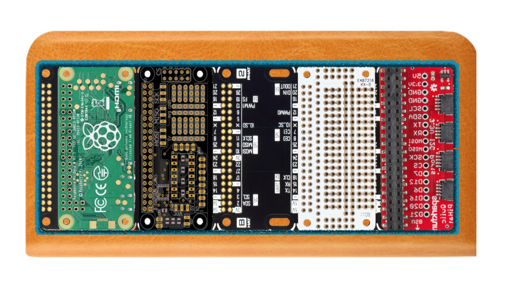

  
Raspberryproduce is a test store for RPI Zero based physics toys & learning steps from prototype to production.

  

RPI Zero Demon hunting kit
Elecricity is creepy as hell--demon-straightion charge conservation in the style of Carver Mims.
   CED versus fluid analogy of charge

* Basic analog kit
* USB charged, solar powered kit
* High power wifi enabled flashlight kit--dims light when demon present
* Combine with Hats for custom displays.

REDONKULOUSLY SENSITIVE 1 FET
ELECTRIC CHARGE DETECTOR 
©1987 William J. Beaty
<article>(http://amasci.com/emotor/chargdet.html)

Solarbotics version [circuits](http://solarbotics.net/library/circuits/sensors_field.html)

  

Cuban Flatbread portable prototyping workstation.
Shared GPIO bus for Hats utilizing a Pimoroni backplane in combination with the Sparkfun breakouts with 1mm pitch, 4-pin JST connector as the last Hat on the bus. 

The design is intended to save time prototyping gizmos as well as larger systems in the same dev-env, to include all required system functionality & power, while minimzing custom work & maintaining a mobile environment. 

Extend pinout.xyz to all known hats & add links to store.

  

  
  

## Stage Zero [pdf](pdf/stagezero.pdf)
RPI Zero hardware & software setup
  
## Stage I [pdf](pdf/stagei.pdf)
Portable, compact, RPI Zero focused breadboarding with integration of [Pigpio](http://abyz.me.uk/rpi/pigpio/).
  
## Stage II [pdf](pdf/stageii.pdf)
Cuban Flatbread: Multiple hats with GPIO &/or I2C plugs
Check again pin collions: [pinout.xyz](https://pinout.xyz/phatstack)
  
### Stage III [pdf](pdf/stageiii.pdf)
Receive analog in from demon hunter.
### Stage IV 
Display: Neopixel & oscilloscope display & audio output of electroscope input.
### Stage V 
Solder electrocope to protohat
## Stage VI [pdf](pdf/stagevi.pdf)
Bring protohat circuit into Kicad
## Stage VII [pdf](pdf/stagevi.pdf)
Send Gerbers to PCB for production
  

## Status
Concept consolidation: rpi electroscope--from physics to production.
  

## Next Steps
Source parts. Have: Zero, FET, cap, 1Mohm, breadboard, protoboard, surface mount short header, li-bat. Need: Bat charger circuit, phat stack, solder.

Test electroscope.
Write instructions for bringing to breadboard on-hand.
Write instructions for moving to protoboard on-hand.
Write instruction along the way.
Source solar charge circuit.
Determine minimum battery size.
Sourcing, assembly, testing of Cuban Flatbread 
  

  
## Donations
eGiftCard:  theloniustrout@gmail.com 
Fiat:       paypal.me/entangled@gmail.com 
Bitcoin:    36fAic98Sevtonnr75orbn3w3tGfVcct8V 
STEEM:      @theloniustrout 

[Wishlist](fuel.pdf)

