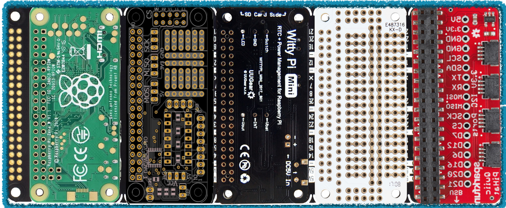

  
Raspberryproduce is a store for curating & distributing the best RPI Zero tools for the design, development, & production of village infrastructure using the best of the best, but doing it on the cheap. 

The tool kits are  dev tools for control & automation of: information, fluid & mechanical work & storage on the respective platforms: Linux/Python, [Cyclone](http://cyclone-power.com) steam power & fluid energy storage & conversion, [VESC](http://vesc-project.com) electrical power conversion.

  

The unifying concept for the store is a new class of PC, code name--Cuban Flatbread. The PC is itself a maximally generalized & flexibile prototyping environment. The configuration reduces to the prototype & production tools as the prototype evolves, without significant changes to the dev-env. 

The enabling concept is the utilization shared GPIO for Hats utilizing Pimoroni backplane which brings the functionality behond the level of gizmos & into proper systems. In one of the slots are 4 port I2C plugs in order to fold in the Sparkfun ecosystem.

Integrated & low profile with minimal need for breadboarding; simplifies the initial development & consolidating the system for manageable & even portable workspaces as the design is iterated.

  

  
  

80% of all energy used on the planet goes to spinning electrical motors. The majority of these are subpar in efficiency; & developing nations are bringing more online exponentially. 

Price is the barrier to entry for light industrial development of village centers & cottage industry. The best of the best quality brushless drives,are now availble for the cost of the PCB & BOM. Therefore, getting the best systems into builders hands brings the heart of mechanical industrial processes to the status of a commodity, circumventing the inefficiencies of a gradual upgrades as villages develop.

While the focus is the highest quality industrial grade processes; the prices, openness, architecture, applicability, & efficiency remain optimal & best of class due to the open architecture.

Cash poor villages, therefore, do not need to build on low efficiency systems; you can start at the top for the same price--analogous to the commonidfication of Linux machines.

Economically, the intention is to catalyze distributed ownership of manufacturing to compete with centralized displacement of workers via AI,robotics, & end-user consumption of leased product marketing.

All products are scalable from single family to village-sized or larger & are intended to outperform modern western industry standards, E.g. by utilizing FOC drives with Python interconnects as the default solution.

  

## Stage Zero [pdf](pdf/stagezero.pdf)
RPI Zero hardware & software setup
## Stage I [pdf](pdf/stagei.pdf)
Portable, compact, RPI Zero focused breadboarding with integration of [Pigpio](http://abyz.me.uk/rpi/pigpio/).
## Stage II [pdf](pdf/stageii.pdf)
Cuban Flatbread: Multiple hats with GPIO &/or I2C plugs
## Stage III [pdf](pdf/stageiii.pdf)
Analog I/O & oscilloscope
## Stage IV [pdf](pdf/stageiv.pdf)
Mixing of breadboard designs & hats; reduction of function
## Stage V [pdf](pdf/stagev.pdf)
Add custom power. Further reduction of sauce, moving breadboard circuits to protoboards
## Stage VI [pdf](pdf/stagevi.pdf)
Custom hat development, research, testing

  

## Status
Concept development
  

## Next Steps
Sourcing, assembly, testing of Cuban Flatbread 
Toss in VESC
  

## Major Milestone Targets
* Integration of Cuban Flatbread with 25KWH fluid energy storage & flex-fuel powered 25 VESC mechanical device as end-to-end reference platform, Sri Lanka

* Conceptual foundational support with Collective Electrodynamics electronics from first principles Coursework

  
## Donations
eGiftCard:  theloniustrout@gmail.com 
Fiat:       paypal.me/entangled@gmail.com 
Bitcoin:    36fAic98Sevtonnr75orbn3w3tGfVcct8V 
STEEM:      @theloniustrout 

[Wishlist](fuel.pdf)

