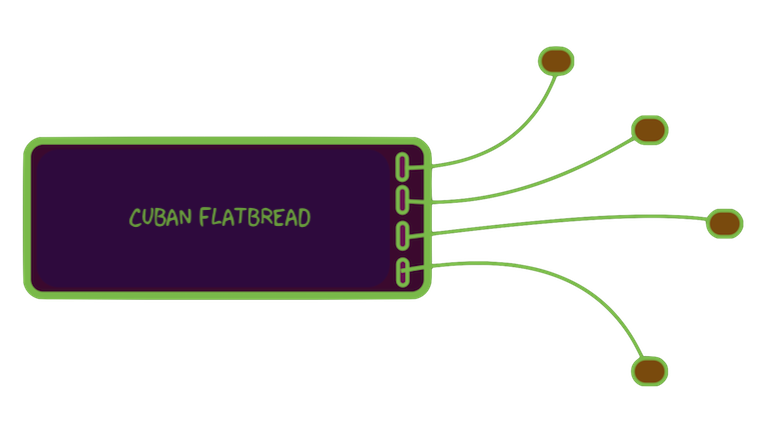

  
Raspberryproduce is a store for curating & distributing the best RPI Zero tools with a focus on the design, development, & production of village infrastructure. 

Specifically, the tool kits are dev tools for control & automation of: information, fluid & mechanical work & storage on the respective platforms: Linux/Python, [Cyclone](http://cyclone-power.com) steam engines, energy storage & conversion; & [VESC](http://vesc-project.com) electrical power conversion.

  

The unifying concept for the store is a new class of PC, code name--Cuban Flatbread. This PC is designed to be a flexibile prototyping environment for power & mechanical systems. 

The configuration reduces to the prototype & production tools as the prototype evolves, without significant changes to the dev-env. 

The enabling concept is the utilization of shared GPIO for Hats utilizing a Pimoroni backplane in combination with the Sparkfun I2C ecology with standardized JST 1mm plugs. The mashup brings the functionality beyond the level of gizmos & into more useful systems while minimzing custom work. 

Low profile, highly integrated, with minimal need for breadboarding, simplifies the initial development while consolidating the system for manageable & portable workspaces.

  

  
  

The initial reference designs will focus on support systems for the VESC electric motor driver & power conversion software.

80% of all energy used on the planet goes to spinning electrical motors inefficiently. Developing nations are bringing more online exponentially with a bias toward inexpensive systems. Therefore potentially 5% or more overall gains are possible by lowering the price barrier to high performance energy utilization.

Highly refined software commutation is now availble for the cost of the PCB & BOM up to 10's of kw power density. Therefore, getting the best systems into builders hands brings the heart of mechanical industrial processes to the status of a commodity, circumventing the inefficiencies & misery of a gradual upgrade proess.

Economically, the intention is to catalyze distributed ownership of manufacturing to compete with centralized displacement of workers via AI,robotics, & end-user consumption of leased product marketing.

All products are scalable from single family to village-sized or larger & are intended to outperform modern western industry standards, E.g. by utilizing wide-bandgap FOC drives with Python interfacing as the default solution.

  

## Stage Zero [pdf](pdf/stagezero.pdf)
RPI Zero hardware & software setup
## Stage I [pdf](pdf/stagei.pdf)
Portable, compact, RPI Zero focused breadboarding with integration of [Pigpio](http://abyz.me.uk/rpi/pigpio/).
## Stage II [pdf](pdf/stageii.pdf)
Cuban Flatbread: Multiple hats with GPIO &/or I2C plugs
## Stage III [pdf](pdf/stageiii.pdf)
Analog I/O & oscilloscope
## Stage IV [pdf](pdf/stageiv.pdf)
Mixing of breadboard designs & hats; reduction of function
## Stage V [pdf](pdf/stagev.pdf)
Add custom power. Further reduction of sauce, moving breadboard circuits to protoboards
## Stage VI [pdf](pdf/stagevi.pdf)
Custom hat development, research, testing

  

## Status
Concept development
  

## Next Steps
Sourcing, assembly, testing of Cuban Flatbread 
Toss in VESC
  

## Major Milestone Targets
* Integration of Cuban Flatbread with 25KWH fluid energy storage & flex-fuel powered 25 VESC mechanical device as end-to-end reference platform, Sri Lanka

* Conceptual foundational support with Collective Electrodynamics electronics from first principles Coursework

  
## Donations
eGiftCard:  theloniustrout@gmail.com 
Fiat:       paypal.me/entangled@gmail.com 
Bitcoin:    36fAic98Sevtonnr75orbn3w3tGfVcct8V 
STEEM:      @theloniustrout 

[Wishlist](fuel.pdf)

